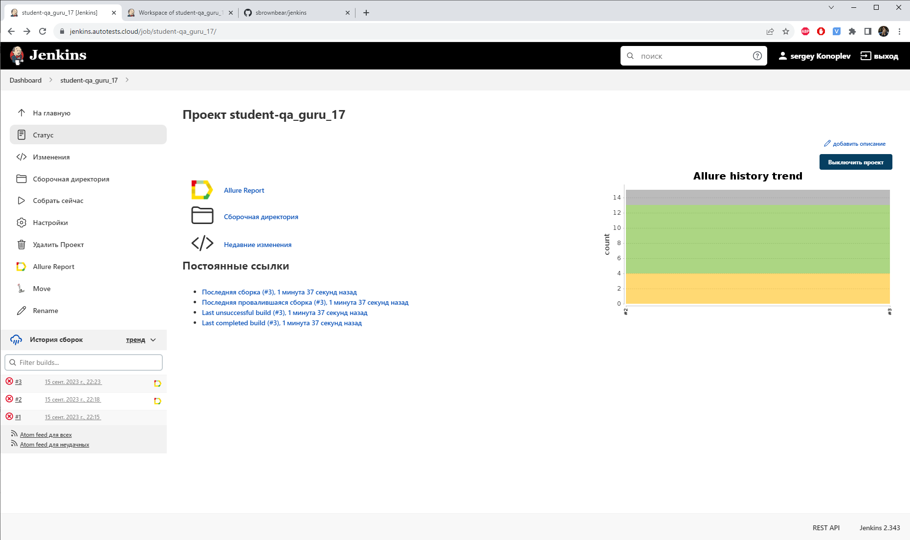
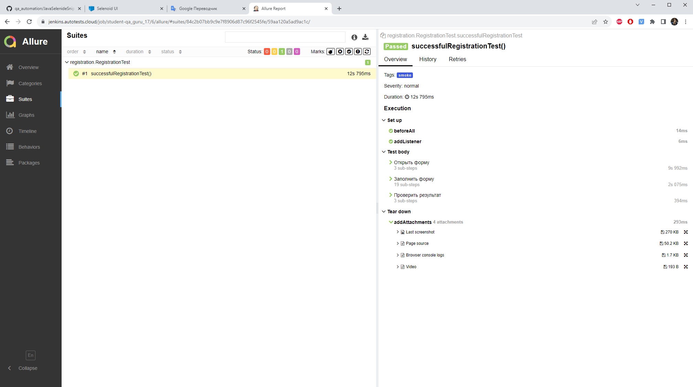

Ссылка на сборку в [Jenkins](https://jenkins.autotests.cloud/job/student-qa_guru_17/)

### Скриншот выполненной работы, тесты "simple": ожидаемый результат - 9 тестов прошли, 4 упало и 2 пропущено

### Скриншот выполненной работы, тест "smoke":

